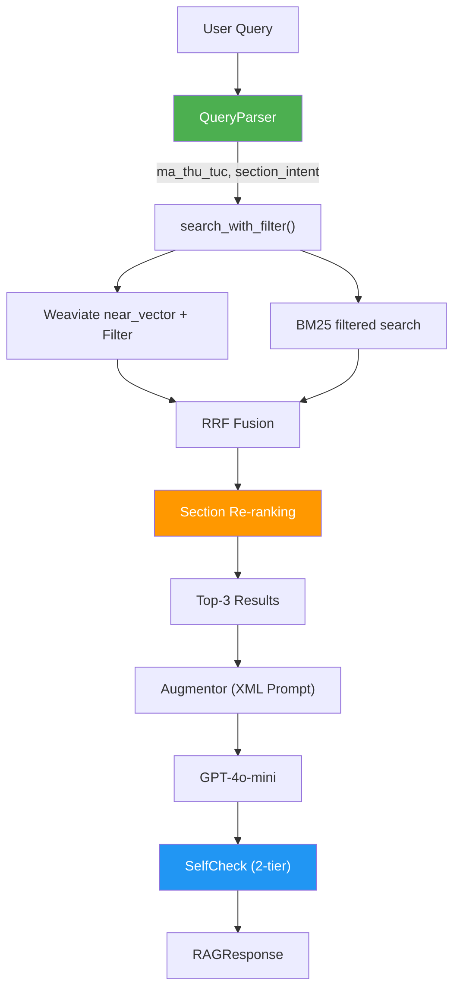

# Architecture — RAG Pipeline (Day 08 Lab)

> Deliverable: Documentation Owner — Nguyễn Duy Minh Hoàng (2A202600155)

## 1. Tổng quan kiến trúc

```
[5,553 TTHC Documents (.md)]
    ↓
[ingest_tthc.py: Parse → Section Chunk → Batch Embed → Store]
    ↓
[Weaviate Cloud Vector Store + In-memory BM25 Index]
    ↓
[KnowledgeBaseAgent: QueryParser → HybridSearch → QualityJudge → Augmentor → LLM → SelfCheck]
    ↓
[RAGResponse: answer + facts + citations + status]
```

**Mô tả ngắn gọn:**
Hệ thống TTHC Assistant là trợ lý tra cứu thủ tục hành chính Việt Nam, phục vụ công dân và cán bộ hành chính. Hệ thống sử dụng kiến trúc **metadata-first RAG** với khả năng lọc theo mã thủ tục, cơ quan thực hiện, và nhận diện section intent (phí, thời hạn, hồ sơ, ...) để trả lời chính xác từng phần cụ thể của thủ tục. Pipeline kết hợp Vector Search + BM25 qua Reciprocal Rank Fusion, với section-aware re-ranking để đảm bảo đúng section được ưu tiên.

---

## 2. Indexing Pipeline (Sprint 1)

### Tài liệu được index
| File | Nguồn | Department | Số chunk |
|------|-------|-----------| ---------|
| 386 files `.md` (từ 5,553 TTHC) | dichvucong.gov.vn API | 20+ Bộ/Ngành | 2,792 chunks |
| BoCongAn/*.md | Bộ Công An | Quản lý vũ khí, VOS | ~150 chunks |
| BoCongThuong/*.md | Bộ Công Thương | Thương mại, XNK | ~300 chunks |
| BoTuPhap/*.md | Bộ Tư Pháp | Hộ tịch, công chứng | ~200 chunks |
| BoYTe/*.md | Bộ Y Tế | Dược phẩm, khám chữa bệnh | ~180 chunks |
| + 16 Bộ/Ngành khác | ... | ... | ... |

### Quyết định chunking
| Tham số | Giá trị | Lý do |
|---------|---------|-------|
| Chunk size | 1200 ký tự (~300 tokens) | Vừa đủ chứa 1 section TTHC hoàn chỉnh, không quá dài để "lost in the middle" |
| Overlap | 200 ký tự | Giữ ngữ cảnh liền mạch khi section bị cắt giữa chừng |
| Chunking strategy | **Section-based parent-child** | Mỗi `## heading` tạo 1 parent; nếu > 1200 chars thì tách child. Sub-section detection gán lại `section_type` cho child chunks chứa nội dung khác section cha |
| Metadata fields | `ma_thu_tuc`, `section_type`, `agency_folder`, `linh_vuc`, `co_quan_thuc_hien`, `source_url`, `quyet_dinh`, `doc_id` | Phục vụ filter, routing, citation, freshness |

### Embedding model
- **Model**: OpenAI `text-embedding-3-small` (1536 dim) — batch mode 500 texts/request
- **Vector store**: Weaviate Cloud (Asia-Southeast1)
- **BM25 Index**: In-memory `rank_bm25.BM25Okapi` (rebuilt sau mỗi ingestion)
- **Similarity metric**: Cosine (Weaviate default)
- **Ingestion throughput**: ~105 chunks/giây (batch embed → Weaviate insert)

---

## 3. Retrieval Pipeline (Sprint 2 + 3)

### Baseline (Sprint 2)
| Tham số | Giá trị |
|---------|---------|
| Strategy | Dense only (Weaviate near_vector) |
| Top-k search | 5 |
| Top-k select | 3 |
| Rerank | Không |
| Filter | Không |
| **Doc Hit @3** | **100%** |
| **Section Hit @3** | **40%** |

### Variant — Hybrid + Section Re-ranking (Sprint 3)
| Tham số | Giá trị | Thay đổi so với baseline |
|---------|---------|------------------------|
| Strategy | **Hybrid** (Dense + BM25 → RRF) | Thêm BM25 keyword matching |
| Top-k search | 9 (over-fetch 3×) | Lấy nhiều candidate hơn cho re-ranking |
| Top-k select | 3 | Giữ nguyên |
| Rerank | **Section-aware re-ranking** | Boost chunk có `section_type` trùng `section_intent` |
| Filter | **Weaviate metadata pre-filter** | `doc_id = ma_thu_tuc` khi QueryParser phát hiện mã |
| Query transform | **QueryParser intent detection** | Weighted keyword scoring (len-based) |
| **Doc Hit @3** | **100%** | Không đổi |
| **Section Hit @3** | **100%** | +60 pp ↑ |
| **Filter Precision** | **100%** | Mới |

**Lý do chọn variant này:**
> Chọn Hybrid + Section Re-ranking vì:
> 1. **Hybrid**: Corpus TTHC chứa cả ngôn ngữ tự nhiên (mô tả thủ tục) lẫn mã số chính xác (3.000391, 42/2024/QH15). Dense search không tìm được exact match cho mã số; BM25 bổ sung keyword precision.
> 2. **Section Re-ranking**: Document TTHC có ~10 section (phí, thời hạn, hồ sơ, ...). Dense search thường trả đúng doc nhưng sai section. QueryParser đã detect được intent (ví dụ: "phí bao nhiêu?" → `phi_le_phi`), nên ta over-fetch rồi đẩy chunk matching section lên đầu.
> 3. **Sub-section detection**: Markdown gốc thường gom nhiều section vào 1 heading `## Thời hạn giải quyết` (chứa luôn phí, hồ sơ, pháp lý). Chunker cần scan nội dung child chunk để gán lại `section_type` chính xác.

---

## 4. Generation (Sprint 2)

### Grounded Prompt Template
```xml
<system>
Bạn là trợ lý tra cứu thủ tục hành chính Việt Nam.
Trả lời DUY NHẤT dựa trên evidence bên dưới.
Nếu evidence không đủ, nói rõ "Không đủ dữ liệu".
Trích dẫn nguồn bằng [1], [2], ...
Trả lời ngắn gọn, chính xác, có cấu trúc.
</system>

<question>{query}</question>

<evidence>
[1] source={source} | section={section_type} | ma_thu_tuc={ma_thu_tuc}
{chunk_text}

[2] ...
</evidence>
```

### LLM Configuration
| Tham số | Giá trị |
|---------|---------|
| Model | GPT-4o-mini |
| Temperature | 0 (deterministic cho eval) |
| Max tokens | 512 |
| Self-check | 2-tier: Rule-based (T1) → LLM conditional (T2) |

---

## 5. Failure Mode Checklist

| Failure Mode | Triệu chứng | Cách kiểm tra | Giải pháp đã áp dụng |
|-------------|-------------|---------------|----------------------|
| Chunking gom section | Section Hit thấp (40%) | Kiểm tra `section_type` metadata | Sub-section detection trong `_detect_subsection()` |
| Intent misdetect | Parser nhầm "cơ quan" thành "trình tự" | Debug `parsed.section_intent` | Weighted keyword scoring (len-based) |
| Dense miss keyword | Mã thủ tục exact match fail | So sánh BM25 vs Dense scores | Hybrid search (BM25 + Dense → RRF) |
| Weaviate filter sai | Results chứa doc khác | `filter_precision()` metric | `doc_id` pre-filter trên Weaviate |

---

## 6. Diagram


